% Gergely Daróczi
% Looong report
% Mon Aug 17 21:32:28 2015

I have written the below report in 10 mins :)

# Dataset

Here I will do a pretty fast report on `mtcars` which is:

-------------------------------------------------------------------------------
         &nbsp;            mpg   cyl   disp   hp   drat   wt    qsec   vs   am 
------------------------- ----- ----- ------ ---- ------ ----- ------ ---- ----
      **Mazda RX4**       21.0    6   160.0  110   3.90  2.620 16.46   0    1  

    **Mazda RX4 Wag**     21.0    6   160.0  110   3.90  2.875 17.02   0    1  

     **Datsun 710**       22.8    4   108.0   93   3.85  2.320 18.61   1    1  

   **Hornet 4 Drive**     21.4    6   258.0  110   3.08  3.215 19.44   1    0  

  **Hornet Sportabout**   18.7    8   360.0  175   3.15  3.440 17.02   0    0  

       **Valiant**        18.1    6   225.0  105   2.76  3.460 20.22   1    0  

     **Duster 360**       14.3    8   360.0  245   3.21  3.570 15.84   0    0  

      **Merc 240D**       24.4    4   146.7   62   3.69  3.190 20.00   1    0  

      **Merc 230**        22.8    4   140.8   95   3.92  3.150 22.90   1    0  

      **Merc 280**        19.2    6   167.6  123   3.92  3.440 18.30   1    0  

      **Merc 280C**       17.8    6   167.6  123   3.92  3.440 18.90   1    0  

     **Merc 450SE**       16.4    8   275.8  180   3.07  4.070 17.40   0    0  

     **Merc 450SL**       17.3    8   275.8  180   3.07  3.730 17.60   0    0  

     **Merc 450SLC**      15.2    8   275.8  180   3.07  3.780 18.00   0    0  

 **Cadillac Fleetwood**   10.4    8   472.0  205   2.93  5.250 17.98   0    0  

 **Lincoln Continental**  10.4    8   460.0  215   3.00  5.424 17.82   0    0  

  **Chrysler Imperial**   14.7    8   440.0  230   3.23  5.345 17.42   0    0  

      **Fiat 128**        32.4    4    78.7   66   4.08  2.200 19.47   1    1  

     **Honda Civic**      30.4    4    75.7   52   4.93  1.615 18.52   1    1  

   **Toyota Corolla**     33.9    4    71.1   65   4.22  1.835 19.90   1    1  

    **Toyota Corona**     21.5    4   120.1   97   3.70  2.465 20.01   1    0  

  **Dodge Challenger**    15.5    8   318.0  150   2.76  3.520 16.87   0    0  

     **AMC Javelin**      15.2    8   304.0  150   3.15  3.435 17.30   0    0  

     **Camaro Z28**       13.3    8   350.0  245   3.73  3.840 15.41   0    0  

  **Pontiac Firebird**    19.2    8   400.0  175   3.08  3.845 17.05   0    0  

      **Fiat X1-9**       27.3    4    79.0   66   4.08  1.935 18.90   1    1  

    **Porsche 914-2**     26.0    4   120.3   91   4.43  2.140 16.70   0    1  

    **Lotus Europa**      30.4    4    95.1  113   3.77  1.513 16.90   1    1  

   **Ford Pantera L**     15.8    8   351.0  264   4.22  3.170 14.50   0    1  

    **Ferrari Dino**      19.7    6   145.0  175   3.62  2.770 15.50   0    1  

    **Maserati Bora**     15.0    8   301.0  335   3.54  3.570 14.60   0    1  

     **Volvo 142E**       21.4    4   121.0  109   4.11  2.780 18.60   1    1  
-------------------------------------------------------------------------------

Table: Table continues below

 
---------------------------------------
         &nbsp;            gear   carb 
------------------------- ------ ------
      **Mazda RX4**         4      4   

    **Mazda RX4 Wag**       4      4   

     **Datsun 710**         4      1   

   **Hornet 4 Drive**       3      1   

  **Hornet Sportabout**     3      2   

       **Valiant**          3      1   

     **Duster 360**         3      4   

      **Merc 240D**         4      2   

      **Merc 230**          4      2   

      **Merc 280**          4      4   

      **Merc 280C**         4      4   

     **Merc 450SE**         3      3   

     **Merc 450SL**         3      3   

     **Merc 450SLC**        3      3   

 **Cadillac Fleetwood**     3      4   

 **Lincoln Continental**    3      4   

  **Chrysler Imperial**     3      4   

      **Fiat 128**          4      1   

     **Honda Civic**        4      2   

   **Toyota Corolla**       4      1   

    **Toyota Corona**       3      1   

  **Dodge Challenger**      3      2   

     **AMC Javelin**        3      2   

     **Camaro Z28**         3      4   

  **Pontiac Firebird**      3      2   

      **Fiat X1-9**         4      1   

    **Porsche 914-2**       5      2   

    **Lotus Europa**        5      2   

   **Ford Pantera L**       5      4   

    **Ferrari Dino**        5      6   

    **Maserati Bora**       5      8   

     **Volvo 142E**         4      2   
---------------------------------------

# Descriptives

-------------------------------------------------------------
  &nbsp;    Average   Median   Standard.deviation   Variance 
---------- --------- -------- -------------------- ----------
 **mpg**    20.0906   19.200         6.0269        3.632e+01 

 **cyl**    6.1875    6.000          1.7859        3.190e+00 

 **disp**  230.7219  196.300        123.9387       1.536e+04 

  **hp**   146.6875  123.000        68.5629        4.701e+03 

 **drat**   3.5966    3.695          0.5347        2.859e-01 

  **wt**    3.2172    3.325          0.9785        9.574e-01 

 **qsec**   17.8487   17.710         1.7869        3.193e+00 

  **vs**    0.4375    0.000          0.5040        2.540e-01 

  **am**    0.4062    0.000          0.4990        2.490e-01 

 **gear**   3.6875    4.000          0.7378        5.444e-01 

 **carb**   2.8125    2.000          1.6152        2.609e+00 
-------------------------------------------------------------

## In details

### mpg

We found the folloing values here:

_21_, _21_, _22.8_, _21.4_, _18.7_, _18.1_, _14.3_, _24.4_, _22.8_, _19.2_, _17.8_, _16.4_, _17.3_, _15.2_, _10.4_, _10.4_, _14.7_, _32.4_, _30.4_, _33.9_, _21.5_, _15.5_, _15.2_, _13.3_, _19.2_, _27.3_, _26_, _30.4_, _15.8_, _19.7_, _15_ and _21.4_

The mean of mpg is _20.09_ while the standard deviation is: _6.027_. The most frequent value in mpg is 10.4, but let us check out the frequency table too:

Internal `pander` error: `Wrong number of parameters (11 instead of *12*) passed: justify` while running: `table(mtcars[, v])`

Please [report the issue](https://github.com/Rapporter/pander/issues/new) with a reproducible example to help developers fix this ASAP.

Tables are boring, let us show the same with a `histogram`:

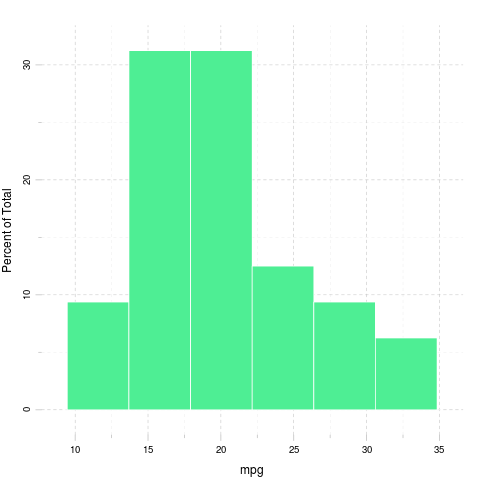

### cyl

We found the folloing values here:

_6_, _6_, _4_, _6_, _8_, _6_, _8_, _4_, _4_, _6_, _6_, _8_, _8_, _8_, _8_, _8_, _8_, _4_, _4_, _4_, _4_, _8_, _8_, _8_, _8_, _4_, _4_, _4_, _8_, _6_, _8_ and _4_

The mean of cyl is _6.188_ while the standard deviation is: _1.786_. The most frequent value in cyl is 8, but let us check out the frequency table too:

-----------
 4   6   8 
--- --- ---
11   7  14 
-----------

Tables are boring, let us show the same with a `histogram`:

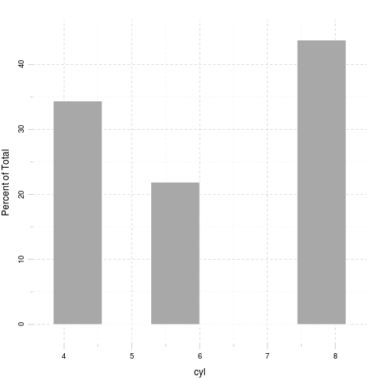

### disp

We found the folloing values here:

_160_, _160_, _108_, _258_, _360_, _225_, _360_, _146.7_, _140.8_, _167.6_, _167.6_, _275.8_, _275.8_, _275.8_, _472_, _460_, _440_, _78.7_, _75.7_, _71.1_, _120.1_, _318_, _304_, _350_, _400_, _79_, _120.3_, _95.1_, _351_, _145_, _301_ and _121_

The mean of disp is _230.7_ while the standard deviation is: _123.9_. The most frequent value in disp is 275.8, but let us check out the frequency table too:

Internal `pander` error: `Wrong number of parameters (11 instead of *12*) passed: justify` while running: `table(mtcars[, v])`

Please [report the issue](https://github.com/Rapporter/pander/issues/new) with a reproducible example to help developers fix this ASAP.

Tables are boring, let us show the same with a `histogram`:

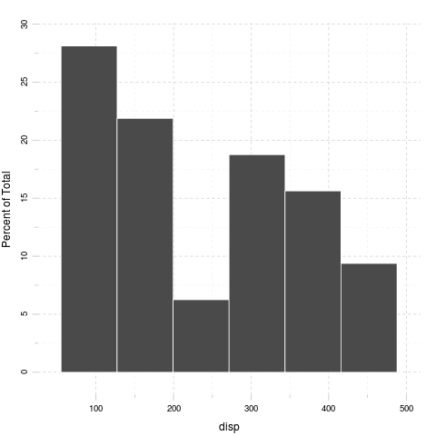

### hp

We found the folloing values here:

_110_, _110_, _93_, _110_, _175_, _105_, _245_, _62_, _95_, _123_, _123_, _180_, _180_, _180_, _205_, _215_, _230_, _66_, _52_, _65_, _97_, _150_, _150_, _245_, _175_, _66_, _91_, _113_, _264_, _175_, _335_ and _109_

The mean of hp is _146.7_ while the standard deviation is: _68.56_. The most frequent value in hp is 110, but let us check out the frequency table too:

Internal `pander` error: `Wrong number of parameters (14 instead of *15*) passed: justify` while running: `table(mtcars[, v])`

Please [report the issue](https://github.com/Rapporter/pander/issues/new) with a reproducible example to help developers fix this ASAP.

Tables are boring, let us show the same with a `histogram`:

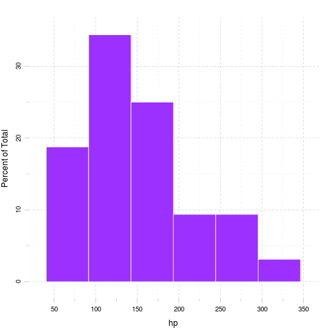

### drat

We found the folloing values here:

_3.9_, _3.9_, _3.85_, _3.08_, _3.15_, _2.76_, _3.21_, _3.69_, _3.92_, _3.92_, _3.92_, _3.07_, _3.07_, _3.07_, _2.93_, _3_, _3.23_, _4.08_, _4.93_, _4.22_, _3.7_, _2.76_, _3.15_, _3.73_, _3.08_, _4.08_, _4.43_, _3.77_, _4.22_, _3.62_, _3.54_ and _4.11_

The mean of drat is _3.597_ while the standard deviation is: _0.5347_. The most frequent value in drat is 3.07, but let us check out the frequency table too:

Internal `pander` error: `Wrong number of parameters (12 instead of *13*) passed: justify` while running: `table(mtcars[, v])`

Please [report the issue](https://github.com/Rapporter/pander/issues/new) with a reproducible example to help developers fix this ASAP.

Tables are boring, let us show the same with a `histogram`:

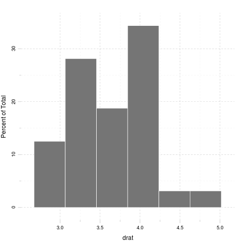

### wt

We found the folloing values here:

_2.62_, _2.875_, _2.32_, _3.215_, _3.44_, _3.46_, _3.57_, _3.19_, _3.15_, _3.44_, _3.44_, _4.07_, _3.73_, _3.78_, _5.25_, _5.424_, _5.345_, _2.2_, _1.615_, _1.835_, _2.465_, _3.52_, _3.435_, _3.84_, _3.845_, _1.935_, _2.14_, _1.513_, _3.17_, _2.77_, _3.57_ and _2.78_

The mean of wt is _3.217_ while the standard deviation is: _0.9785_. The most frequent value in wt is 3.44, but let us check out the frequency table too:

Internal `pander` error: `Wrong number of parameters (11 instead of *12*) passed: justify` while running: `table(mtcars[, v])`

Please [report the issue](https://github.com/Rapporter/pander/issues/new) with a reproducible example to help developers fix this ASAP.

Tables are boring, let us show the same with a `histogram`:

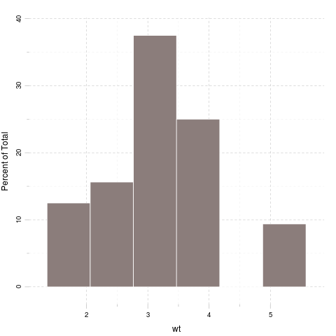

### qsec

We found the folloing values here:

_16.46_, _17.02_, _18.61_, _19.44_, _17.02_, _20.22_, _15.84_, _20_, _22.9_, _18.3_, _18.9_, _17.4_, _17.6_, _18_, _17.98_, _17.82_, _17.42_, _19.47_, _18.52_, _19.9_, _20.01_, _16.87_, _17.3_, _15.41_, _17.05_, _18.9_, _16.7_, _16.9_, _14.5_, _15.5_, _14.6_ and _18.6_

The mean of qsec is _17.85_ while the standard deviation is: _1.787_. The most frequent value in qsec is 17.02, but let us check out the frequency table too:

Internal `pander` error: `Wrong number of parameters (10 instead of *11*) passed: justify` while running: `table(mtcars[, v])`

Please [report the issue](https://github.com/Rapporter/pander/issues/new) with a reproducible example to help developers fix this ASAP.

Tables are boring, let us show the same with a `histogram`:

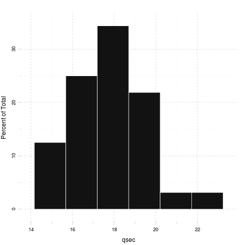

### vs

We found the folloing values here:

_0_, _0_, _1_, _1_, _0_, _1_, _0_, _1_, _1_, _1_, _1_, _0_, _0_, _0_, _0_, _0_, _0_, _1_, _1_, _1_, _1_, _0_, _0_, _0_, _0_, _1_, _0_, _1_, _0_, _0_, _0_ and _1_

The mean of vs is _0.4375_ while the standard deviation is: _0.504_. The most frequent value in vs is 0, but let us check out the frequency table too:

-------
 0   1 
--- ---
18  14 
-------

Tables are boring, let us show the same with a `histogram`:

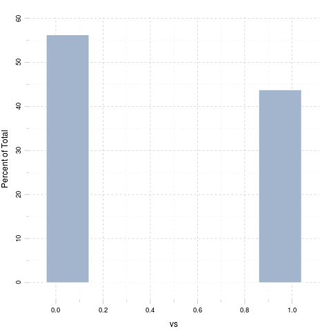

### am

We found the folloing values here:

_1_, _1_, _1_, _0_, _0_, _0_, _0_, _0_, _0_, _0_, _0_, _0_, _0_, _0_, _0_, _0_, _0_, _1_, _1_, _1_, _0_, _0_, _0_, _0_, _0_, _1_, _1_, _1_, _1_, _1_, _1_ and _1_

The mean of am is _0.4062_ while the standard deviation is: _0.499_. The most frequent value in am is 0, but let us check out the frequency table too:

-------
 0   1 
--- ---
19  13 
-------

Tables are boring, let us show the same with a `histogram`:

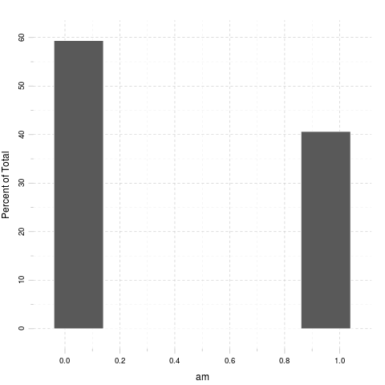

### gear

We found the folloing values here:

_4_, _4_, _4_, _3_, _3_, _3_, _3_, _4_, _4_, _4_, _4_, _3_, _3_, _3_, _3_, _3_, _3_, _4_, _4_, _4_, _3_, _3_, _3_, _3_, _3_, _4_, _5_, _5_, _5_, _5_, _5_ and _4_

The mean of gear is _3.688_ while the standard deviation is: _0.7378_. The most frequent value in gear is 3, but let us check out the frequency table too:

-----------
 3   4   5 
--- --- ---
15  12   5 
-----------

Tables are boring, let us show the same with a `histogram`:

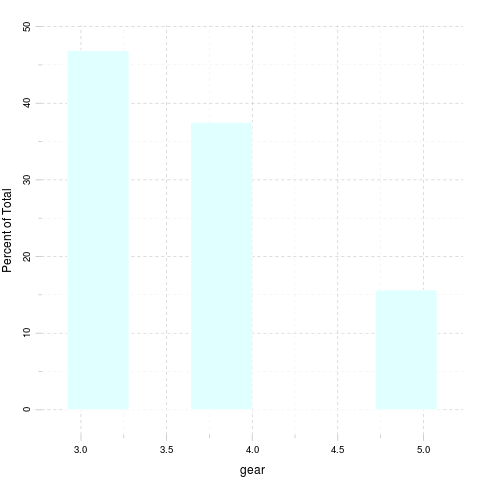

### carb

We found the folloing values here:

_4_, _4_, _1_, _1_, _2_, _1_, _4_, _2_, _2_, _4_, _4_, _3_, _3_, _3_, _4_, _4_, _4_, _1_, _2_, _1_, _1_, _2_, _2_, _4_, _2_, _1_, _2_, _2_, _4_, _6_, _8_ and _2_

The mean of carb is _2.812_ while the standard deviation is: _1.615_. The most frequent value in carb is 2, but let us check out the frequency table too:

-----------------------
 1   2   3   4   6   8 
--- --- --- --- --- ---
 7  10   3  10   1   1 
-----------------------

Tables are boring, let us show the same with a `histogram`:

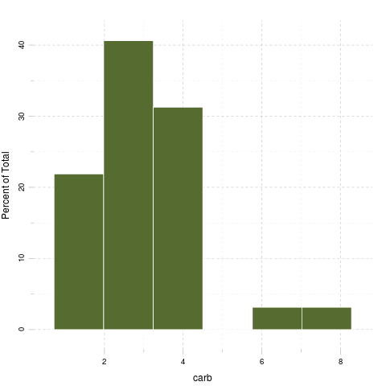

# Correlation

And here goes a correlation table:

---------------------------------------------------------------------------
  &nbsp;     mpg     cyl    disp     hp      drat     wt     qsec     vs   
---------- ------- ------- ------- ------- -------- ------- ------- -------
 **mpg**   1.0000  -0.8522 -0.8476 -0.7762 0.68117  -0.8677 0.4187  0.6640 

 **cyl**   -0.8522 1.0000  0.9020  0.8324  -0.69994 0.7825  -0.5912 -0.8108

 **disp**  -0.8476 0.9020  1.0000  0.7909  -0.71021 0.8880  -0.4337 -0.7104

  **hp**   -0.7762 0.8324  0.7909  1.0000  -0.44876 0.6587  -0.7082 -0.7231

 **drat**  0.6812  -0.6999 -0.7102 -0.4488 1.00000  -0.7124 0.0912  0.4403 

  **wt**   -0.8677 0.7825  0.8880  0.6587  -0.71244 1.0000  -0.1747 -0.5549

 **qsec**  0.4187  -0.5912 -0.4337 -0.7082 0.09120  -0.1747 1.0000  0.7445 

  **vs**   0.6640  -0.8108 -0.7104 -0.7231 0.44028  -0.5549 0.7445  1.0000 

  **am**   0.5998  -0.5226 -0.5912 -0.2432 0.71271  -0.6925 -0.2299 0.1683 

 **gear**  0.4803  -0.4927 -0.5556 -0.1257 0.69961  -0.5833 -0.2127 0.2060 

 **carb**  -0.5509 0.5270  0.3950  0.7498  -0.09079 0.4276  -0.6562 -0.5696
---------------------------------------------------------------------------

Table: Table continues below

 
------------------------------------
  &nbsp;      am     gear     carb  
---------- -------- ------- --------
 **mpg**   0.59983  0.4803  -0.55093

 **cyl**   -0.52261 -0.4927 0.52699 

 **disp**  -0.59123 -0.5556 0.39498 

  **hp**   -0.24320 -0.1257 0.74981 

 **drat**  0.71271  0.6996  -0.09079

  **wt**   -0.69250 -0.5833 0.42761 

 **qsec**  -0.22986 -0.2127 -0.65625

  **vs**   0.16835  0.2060  -0.56961

  **am**   1.00000  0.7941  0.05753 

 **gear**  0.79406  1.0000  0.27407 

 **carb**  0.05753  0.2741  1.00000 
------------------------------------

And the same on a graph:

Yeah, that latter took a while to render in an image file :)

That's not a `pander` issue.

# Some models

Okay, let us find out how `weight` affects other variables:

### mpg

A simple linear model: `mtcars$wt ~ mtcars$mpg`

--------------------------------------------------------------
     &nbsp;        Estimate   Std. Error   t value   Pr(>|t|) 
----------------- ---------- ------------ --------- ----------
 **Independent**   -0.1409     0.01474     -9.559   1.294e-10 

 **(Intercept)**    6.0473     0.30869     19.590   1.204e-18 
--------------------------------------------------------------

Table: Fitting linear model: mtcars$wt ~ Independent

### cyl

A simple linear model: `mtcars$wt ~ mtcars$cyl`

--------------------------------------------------------------
     &nbsp;        Estimate   Std. Error   t value   Pr(>|t|) 
----------------- ---------- ------------ --------- ----------
 **Independent**    0.4287     0.06228      6.883   1.218e-07 

 **(Intercept)**    0.5646     0.40062      1.409   1.690e-01 
--------------------------------------------------------------

Table: Fitting linear model: mtcars$wt ~ Independent

### disp

A simple linear model: `mtcars$wt ~ mtcars$disp`

--------------------------------------------------------------
     &nbsp;        Estimate   Std. Error   t value   Pr(>|t|) 
----------------- ---------- ------------ --------- ----------
 **Independent**   0.00701    0.0006629    10.576   1.222e-11 

 **(Intercept)**   1.59981    0.1729964     9.248   2.738e-10 
--------------------------------------------------------------

Table: Fitting linear model: mtcars$wt ~ Independent

### hp

A simple linear model: `mtcars$wt ~ mtcars$hp`

--------------------------------------------------------------
     &nbsp;        Estimate   Std. Error   t value   Pr(>|t|) 
----------------- ---------- ------------ --------- ----------
 **Independent**   0.009401    0.00196      4.796   4.146e-05 

 **(Intercept)**   1.838247    0.31652      5.808   2.389e-06 
--------------------------------------------------------------

Table: Fitting linear model: mtcars$wt ~ Independent

### drat

A simple linear model: `mtcars$wt ~ mtcars$drat`

--------------------------------------------------------------
     &nbsp;        Estimate   Std. Error   t value   Pr(>|t|) 
----------------- ---------- ------------ --------- ----------
 **Independent**    -1.304      0.2345     -5.561   4.784e-06 

 **(Intercept)**    7.906       0.8522      9.277   2.547e-10 
--------------------------------------------------------------

Table: Fitting linear model: mtcars$wt ~ Independent

### qsec

A simple linear model: `mtcars$wt ~ mtcars$qsec`

--------------------------------------------------------------
     &nbsp;        Estimate   Std. Error   t value   Pr(>|t|) 
----------------- ---------- ------------ --------- ----------
 **Independent**   -0.09567    0.09843     -0.9719   0.338868 

 **(Intercept)**   4.92479     1.76541     2.7896    0.009081 
--------------------------------------------------------------

Table: Fitting linear model: mtcars$wt ~ Independent

### vs

A simple linear model: `mtcars$wt ~ mtcars$vs`

--------------------------------------------------------------
     &nbsp;        Estimate   Std. Error   t value   Pr(>|t|) 
----------------- ---------- ------------ --------- ----------
 **Independent**    -1.077      0.2949     -3.654   9.798e-04 

 **(Intercept)**    3.689       0.1950     18.913   3.203e-18 
--------------------------------------------------------------

Table: Fitting linear model: mtcars$wt ~ Independent

### am

A simple linear model: `mtcars$wt ~ mtcars$am`

--------------------------------------------------------------
     &nbsp;        Estimate   Std. Error   t value   Pr(>|t|) 
----------------- ---------- ------------ --------- ----------
 **Independent**    -1.358      0.2583     -5.258   1.125e-05 

 **(Intercept)**    3.769       0.1646     22.895   1.490e-20 
--------------------------------------------------------------

Table: Fitting linear model: mtcars$wt ~ Independent

### gear

A simple linear model: `mtcars$wt ~ mtcars$gear`

--------------------------------------------------------------
     &nbsp;        Estimate   Std. Error   t value   Pr(>|t|) 
----------------- ---------- ------------ --------- ----------
 **Independent**   -0.7735      0.1967     -3.933   4.587e-04 

 **(Intercept)**    6.0697      0.7392      8.212   3.632e-09 
--------------------------------------------------------------

Table: Fitting linear model: mtcars$wt ~ Independent

### carb

A simple linear model: `mtcars$wt ~ mtcars$carb`

--------------------------------------------------------------
     &nbsp;        Estimate   Std. Error   t value   Pr(>|t|) 
----------------- ---------- ------------ --------- ----------
 **Independent**    0.259      0.09998      2.591   1.464e-02 

 **(Intercept)**    2.489      0.32300      7.705   1.353e-08 
--------------------------------------------------------------

Table: Fitting linear model: mtcars$wt ~ Independent

 
